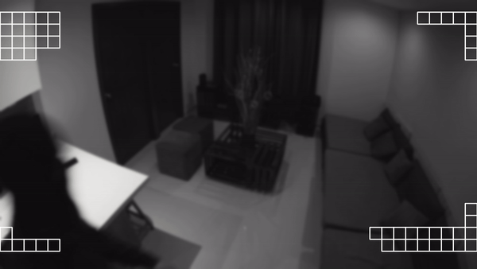

# Block Matching Algorithm

Motion Detection Block Matching Algorithm is an application designed to reduce the computational resources required for analyzing videos by implementing a block matching algorithm for motion detection. This algorithm compares blocks of pixels between consecutive frames to detect motion, allowing for efficient analysis and reducing the workload for AI-based video processing tasks. The application offers customizable block size and matching parameters, making it adaptable to various video processing needs.

## Architecture


## Installation

```bash
  pip3 install -r ./requirements.txt
```

## Deployment

To deploy this project run

```bash
  python3 ./main.py -b block_size -t threshold -i iframe_intervals -m mode -w write -f filename
```

## Demo



## License

[MIT](https://choosealicense.com/licenses/mit/)
